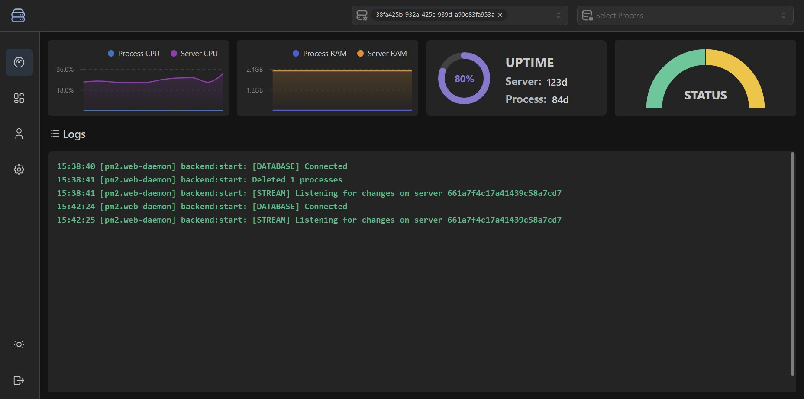
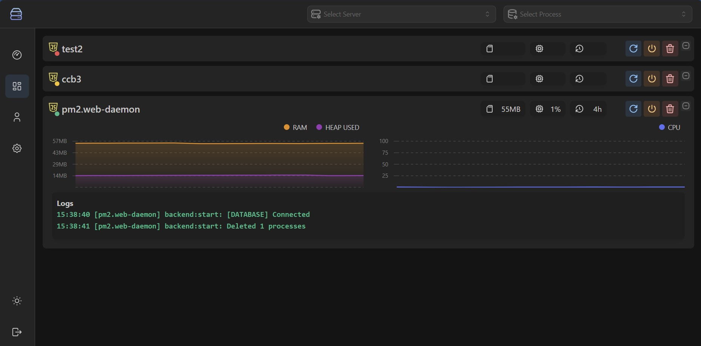
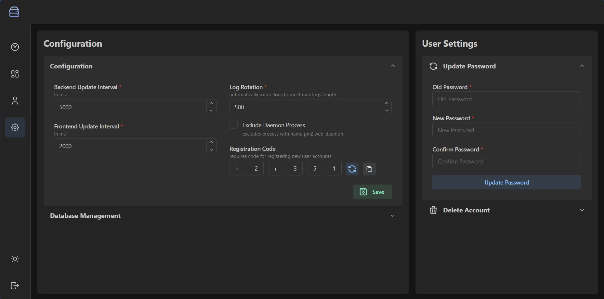

# pm2.web - Process Monitoring and Management

pm2.web is a web-based application designed to monitor and manage processes running on your server using the PM2 process manager. With pm2.web, you can easily monitor your processes, control them with various actions, view logs, manage server functions, and even set up access controls for users.Easily install, deploy to Vercel, and utilize MongoDB Atlas to maintain a server with 0 open ports or host everything on-premise.

## Pages - Features

1. **Monitoring**
   
2. **Process Management**
   
3. **Server Management (Planned)**
4. **Access Control**
   
5. **Settings**
   
6. **Alert Setup (Planned)**

## Installation

To get started with pm2.web, follow these steps:

### Vercel & MongoDB Atlas

<details>
  <summary>Expand</summary>

  #### MongoDB Atlas

  1. Create a MongoDB Atlas account and create a new project.
  2. Create a new cluster and select the free tier.
  3. Create a new database user and save the username and password.
  4. Add your IP address to the IP Access List or through a CIDR block.

  #### Vercel
  [](https://vercel.com/new/clone?repository-url=https%3A%2F%2Fgithub.com%2Foxdev03%2Fpm2.web%2Ftree%2Fmaster%2Fdashboard&env=DB_URI,NEXTAUTH_SECRET&demo-title=pm2.web&demo-description=pm2.web%20-%20Easily%20monitor%20your%20processes%2C%20control%20them%20with%20various%20actions%2C%20view%20logs%20and%20set%20up%20access%20controls%20for%20users%20using%20the%20dashboard&demo-url=https%3A%2F%2Fgithub.com%2Foxdev03%2Fpm2.web&demo-image=https%3A%2F%2Fraw.githubusercontent.com%2Foxdev03%2Fpm2.web%2Fmaster%2Fassets%2Findex.jpeg)

  1. Click the deploy button above and follow the instructions.

  #### Backend
  [Follow the instructions here , On-Premise->Backend](#backend1)

</details>

### On-Premise

<details>
  <summary>Expand</summary>

1. Clone the repository to your server.

   ```bash
   git clone https://github.com/oxdev03/pm2.web.git
   ```

#### Backend 
<a name="backend1"></a>

The Backend is a simple nodejs application that uses the pm2 BUS API to communicate and monitor pm2 process.
It doesn't require any open ports, since it only saves data to the database and events like restart, stop, delete are relayed through the change stream of mongodb.

##### Requirements

- Nodejs v16
- MongoDB Cluster
- PM2

##### Installation

1. Install the dependencies

   ```bash
   cd backend
   npm install
   ```

2. Create a `.env` file in the backend directory and add the following variables

   ```bash
    MONGO_URI=<MongoDB URI>
   ```

3. Start the backend

   ```bash
   npm start
   ```

#### Frontend

##### Requirements

- Open Port 3000 or 80,443 (if you use a reverse proxy)
- Nodejs v16
- MongoDB

##### Installation

1. Install the dependencies

   ```bash
   cd dashboard
   npm install
   ```

2. Create a `.env` file in the dashboard directory and add the following env variables

   ```bash
    MONGO_URI=<MongoDB URI>
    NEXTAUTH_URL=<Index URL of the dashboard eg. http://ip:3000>
   ```

3. Build the frontend

   ```bash
    npm run build
   ```

4. Start the frontend

   ```bash
   npm start
   ```

   </details>

## Usage

Once pm2.web is installed and running, you can perform the following actions:

- **Monitoring**:

  - Monitor the status, resource usage, and health of your processes from the main dashboard.

- **Process**:

  - Stop, restart, or delete processes from the process list page.
  - Access the logs generated by your processes.
  - View key metrics and graphs to assess the performance of your applications.
  - Pm2 Settings & Git Feature

- **Server Management (Planned)**:

  - Control server-level functions such as shutdown or restart using the dedicated server management page.
  - Execute these actions securely without the need for direct server access.
  - View key metrics and graphs
  - Configure specific server settings (db log rotation , polling/update interval)

- **Access Control**:

  - Manage user access and permissions through the access control settings.
  - Create user accounts, assign roles, and specify the level of access each user has to servers, processes, and application functions.

- **Settings**:

  - Configure settings such as the update interval, log rotation, and more.

- **Alert Setup (Planned)**:
  - Configure alerts to receive notifications for specific actions.
  - Define alert rules based on events like shutdown, restart, or kill actions.

- **User Registration**:
  - User can register at the `/login` page
  - If a registration code is configured, the user needs to enter the code
  - The 1st user which registers is automatically assigned the owner permission
  - The owner can assign permissions to registered users through the access control page
  - registered user without any permissions can't access the dashboard nor login
  - accounts linked with oauth2 can't login with credentials (can be unlinked in the settings page)
      - **Setup Github OAuth**
         - https://github.com/settings/developers -> New OAuth App
         - Configure the callback url to `http://<domain|ip:port>/api/auth/callback/github`
         - Add `NEXT_PUBLIC_GITHUB_CLIENT_ID` and `NEXT_GITHUB_SECRET` to the `.env` file with the values from the OAuth App
         - **Usage**: Only registered users (per credentials) can login with auth2, which links the oauth2 with the existing user account in the database
      - **Setup Registration Code**
         - Go to the settings page and add/generate the registration code
      - **Setup Google OAuth**
         - TBD

## Milestones (based on stars)

I have a lot of ideas for this project, but I don't have the time to implement them all due to my busy schedule. Nor the less the project will be maintained even if it doesn't reach the milestones.

- [x] 0 Stars - Active Maintenance/Bug Fixes
- [ ] 20 Stars - Server Management
- [ ] 50 Stars - Alert Setup
- [ ] 100 Stars - Change Database to PostgreSQL for better performance
- [ ] 150 Stars - Live Monitoring (Websocket)

## Contributing

Contributions to pm2.web are welcome! If you would like to contribute to the project, please follow these guidelines:

1. Fork the repository on GitHub.

2. Create a new branch from the `develop` branch to work on your changes.

3. Make your modifications and ensure they adhere to the project's coding standards.

4. Commit your changes with clear and descriptive commit messages.

5. Push your branch to your forked repository.

6. Submit a pull request to the `develop` branch of the main pm2.web repository.

## License

pm2.web is released under the [GNU General Public License v3.0](https://www.gnu.org/licenses/gpl-3.0.en.html). For more information, please refer to the [LICENSE](LICENSE) file.

## Support

For any questions, issues, or feature requests, please refer to the project's GitHub repository: [github.com/oxdev03/pm2.web](https://github.com/oxdev03/pm2.web.git).

Open an issue and provide details about your inquiry, and the community or maintainers will assist you as soon as possible.

## Credits

pm2.web is built on the foundation of the PM2 process manager (BUS Api) ([pm2.keymetrics.io](https://pm2.keymetrics.io/)). We acknowledge and appreciate the PM2 team's efforts.

The pm2.web project is currently maintained and supported by a single developer.

## Disclaimer

pm2.web is not affiliated with or endorsed by PM2 or ([pm2.keymetrics.io](https://pm2.keymetrics.io/)). pm2.web is an independent project created by a third-party developer.
